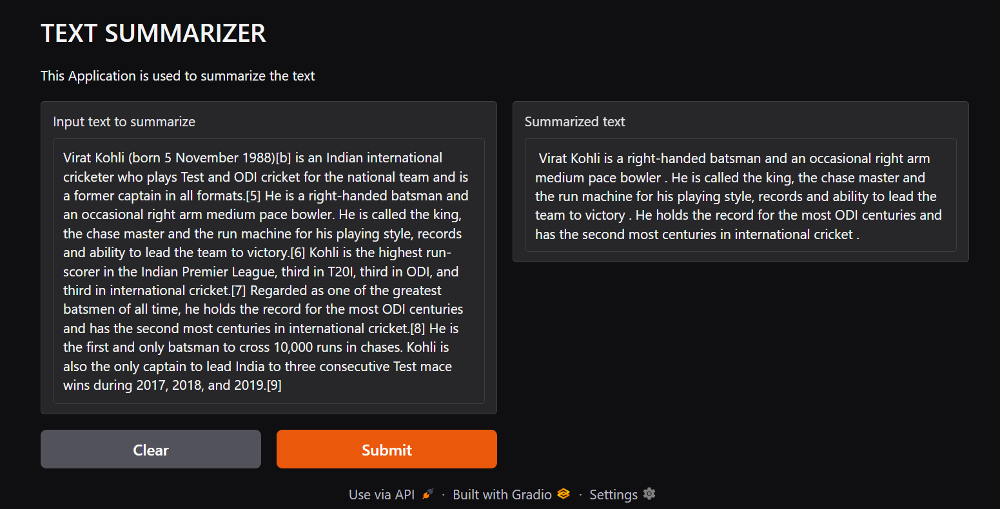

# Generative AI Model with Gradio Deployment

This project is a Generative AI model built using **Transformers**, **Torch**, and **Gradio**. It is deployed on Hugging Face Spaces and utilizes a **DistilBART** model for text generation.

## Features
- Text generation using **DistilBART**.
- Interactive **Gradio** interface for easy access.
- Lightweight and efficient deployment on **Hugging Face Spaces**.

## Requirements
Make sure you have the following dependencies installed:
```bash
pip install transformers torch gradio
```

## Model
This project leverages the **DistilBART** model from Hugging Face. It is a distilled version of **BART**, optimized for efficiency while maintaining high performance.

## Usage
Run the following command to start the Gradio app locally:
```bash
python app.py
```

Once the script is running, a **Gradio interface** will be launched where users can input text and generate outputs.

## File Structure
```
.
├── app.py             # Main application file
├── requirements.txt   # List of dependencies
├── README.md          # Project documentation
├── .gitattributes     # Hugging Face configuration
```




## Contributing
Feel free to fork the repository and improve the project. Pull requests are welcome!

## License
This project is open-source and licensed under the MIT License.


